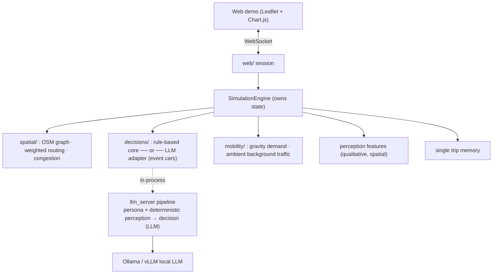

# LLM-Driven Microscopic Traffic ABM on a Real Road Network

**An interactive demo of large-language-model agents making geographically-grounded
travel decisions on the real OSM road network of Tainan, Taiwan.**

Vehicle agents converge on the Asia-Pacific Baseball Stadium during an event-peak scenario.
Each agent perceives its spatial surroundings (congestion ahead on its route, district-level
hotspots, distance to goal), carries a human-like trip memory, and is assigned a behavioural
strategy by an LLM — all visualised live on an interactive map.

> An interactive research demonstration of spatially-grounded LLM agents in a microscopic
> traffic ABM. Companion deep-dive docs (Traditional Chinese): see [Documentation](#documentation).

---

## Highlights

- **Real geography.** Routing and congestion run on a bundled real **OSM road network of Tainan**
  (~10k nodes / ~28k edges, `data/tainan_roads.graphml`) — not a synthetic grid.
- **Spatial perception for LLMs.** Agents are given *anticipatory* spatial context: congestion
  **ahead along their planned route** (`road_ahead`), **district-level congestion hotspots**, a
  city-wide trend, and qualitative local traffic — encoded in compact natural-language labels so
  an LLM can reason without blowing up its context window.
- **Human-like trip memory.** Each agent keeps a single fixed-size qualitative trip `memory` (a
  running one-sentence impression plus trip aggregates) — no short/long split, since at 1 step =
  1 minute the distinction is meaningless. With the LLM core the summary is rewritten by a small
  model exactly when the car re-decides; ambient cars keep no memory. See `docs/MEMORY_zh-TW.md`.
- **LLM-in-the-loop, with a deterministic fallback.** An LLM assigns each agent a behavioural mode
  (e.g. *avoid congestion*, *fastest*, *tolerate*); if the LLM is unavailable the system degrades
  gracefully to a deterministic rule-based policy — the demo never crashes on the show floor.
- **Reproducible.** Same seed → same trajectory. The core simulation, routing, perception and
  memory are fully deterministic.
- **Interactive, single-command web demo.** Leaflet map + live congestion colouring + Chart.js
  analytics + WebSocket streaming; click any vehicle to inspect its persona, memory, and the
  LLM's stated reason for its decision.

---

## Quick start (with `uv`)

This project uses [`uv`](https://docs.astral.sh/uv/). One command installs everything; the demo
runs with the **rule-based decision core by default and needs no LLM/GPU**.

```bash
# 1. install dependencies (creates .venv from pyproject.toml)
uv sync

# 2. launch the local web demo
uv run uvicorn llm_abm_simulator.web.app:app --host 127.0.0.1 --port 8080
```

Then open the local site:

```
http://localhost:8080
```

Press **▶ 開始 (Start)** and watch vehicles route across Tainan toward the stadium, with roads
colouring by congestion in real time.

> If `llm_abm_simulator` is not importable in your environment, prefix with the source path:
> `PYTHONPATH=src uv run uvicorn llm_abm_simulator.web.app:app --host 127.0.0.1 --port 8080`

Run the test suite (the `dev` extra provides `pytest`):

```bash
uv run --extra dev pytest tests/simulator
```

### Enabling LLM decisions (optional)

LLM mode calls a local [Ollama](https://ollama.com) model **in-process** (no extra server, no HTTP hop).

```bash
# make sure Ollama is running and the model is pulled
ollama serve            # if not already running (default port 11434)
ollama pull gpt-oss:20b # or any model you configure
```

Connection settings are read from `.env` (see `.env.example`); sensible localhost defaults apply
if `.env` is absent:

```env
OLLAMA_URL=http://127.0.0.1:11434
OLLAMA_MODE=/api/generate
OLLAMA_MODEL=gpt-oss:20b
```

Start the demo as above, then toggle **決策核心 → LLM** in the control panel. The decision-core
indicator shows whether the LLM or the rule-based core is actually in use (it auto-falls back to the
rule-based core if the LLM errors).

---

## The interactive demo — what you can do

| Action | What you see |
| --- | --- |
| **Start / pause / step / reset / speed** | Drive the simulation forward; reproducible per seed. |
| **Event-car / background-traffic sliders** | Scale event vehicles and **ambient everyday traffic** (gravity-OD, rule-based) live. |
| **Rule ⇄ LLM core toggle** | Switch the event cars' decision core at runtime (LLM auto-fallbacks to the rule-based core). Ambient cars are always rule-based. |
| **Click a vehicle** | Inspect panel: live state, **persona background** (age/occupation/attitudes…), the single **trip memory**, and the **LLM's reason** for its current behavioural mode. |
| **Map** | Roads colour by congestion (incl. minor roads carrying flow); event cars are state-coloured icons, **ambient cars are faded grey dots**; overlapping agents fan out; stadium marked as the destination. |
| **Charts** | Live congestion/arrival/mode charts; post-run **two-layer analysis** — event KPIs + a network-layer (volume, LOS, Top-N bottlenecks, event load share) like a traffic-bureau assessment. |
| **Decision-output viewer** | Browse the raw per-step decision-making output (with each agent's `reason`). |
| **👤 Regenerate personas** | Re-roll the agent persona pool on demand. |

**Scenario.** Vehicles spawn across Tainan's 37 administrative districts and travel to the
Asia-Pacific Baseball Stadium — an event-peak ingress problem where congestion emerges, propagates,
and agents react to it spatially.

---

## System architecture

> 📋 **完整設計參考（paper 用）**：所有功能、設計決策、研究貢獻 vs 基礎建設、誠實限制、可重現性與文件地圖,
> 集中在 [`docs/OVERVIEW_zh-TW.md`](docs/OVERVIEW_zh-TW.md)（單一入口,各項指向細節 doc 與程式碼）。



**Per simulation step:** perceive (speed/congestion/neighbours) → decide behavioural mode
(rule-based or LLM core; ambient cars always rule-based) → move along the weighted-shortest path
(reroute if stuck in congestion; respawn arrived ambient cars) → recompute road flow/congestion
(event + ambient) → update metrics (event KPIs + network layer), memory, and the live snapshot.

The decision pipeline is reached **in-process**: `decisions/llm_adapter.py` calls the `llm_server`
functions directly. `perception` is a **deterministic template (no LLM)**; only `agent_profile` and
`decision_making` call Ollama (the latter with a structured-output schema).
There is no separate decision server and no HTTP hop (the project originated as a GAMA + FastAPI
prototype; that path has since been removed in favour of the in-process pipeline).

---

## Key designs

### 1. Geographically-grounded qualitative perception
Spatial features are computed in Python on the real road graph and handed to the LLM as compact
qualitative labels (tunable thresholds, all in `config/simulation.toml`):

- **Global, sent once per step:** `overall_traffic` (city-wide level), `congestion_trend`
  (improving/steady/worsening vs. the previous step), `congestion_hotspots` (top-K congested
  **districts**, aggregated from where vehicles actually are — O(agents), not O(28k edges)).
- **Per vehicle:** `current_road` (name + class), `traffic_here`, `speed_status` (speed ÷ limit),
  **`road_ahead`** (a forward scan along the planned route: *"jam ~1.2 km ahead on Nanke Rd"*),
  nearby-vehicle count, straight-line distance to goal.

See [`docs/ENVIRONMENT_zh-TW.md`](docs/ENVIRONMENT_zh-TW.md).

### 2. Human-like single trip memory
Replaces an unbounded list of raw per-step snapshots with one fixed-size, qualitative `memory`
(no long/short split — at 1 step = 1 minute the distinction is meaningless):

- A running one-sentence **`summary`** plus the current impression (where, traffic feel, getting
  closer…) and trip aggregates (places jammed, strategy switches, overall smoothness).
- Built by deterministic rolling accumulators (template summary, reproducible). With the **LLM core**,
  the `summary` is rewritten by a small LLM **when the car re-decides** (freshest exactly when it matters).
  Ambient background cars keep no memory.

See [`docs/MEMORY_zh-TW.md`](docs/MEMORY_zh-TW.md).

### 3. Routing & congestion-aware rerouting
Paths are weighted-shortest paths (Dijkstra on the OSM graph). Each edge's cost blends
length/time/comfort/congestion under the agent's behavioural-mode weights; *avoid-congestion*
adds a heavy congestion penalty and a near-block multiplier. When an agent is stuck on a congested
road and its mode allows it, the path is recomputed from the current position — reacting to live
congestion. See [`docs/ACTIVE_MODES_zh-TW.md`](docs/ACTIVE_MODES_zh-TW.md).

### 4. Personas, robustness, reproducibility
- **Persona pool:** LLM personas are generated once into a stable pool and *sliced* per agent count;
  changing the slider never re-generates or churns the file (top-up only when needed).
- **Robust LLM-JSON parsing:** malformed/truncated model output (trailing commas, code fences,
  cut-off arrays) is salvaged object-by-object instead of falling back to defaults.
- **Determinism:** seeded throughout; same seed → identical trajectories.

---

## Configuration — one file, no code edits

All tunable parameters live in **`config/simulation.toml`** (defaults in `config.py` are the
fallback). Sections include:

| Section | Controls |
| --- | --- |
| `[time]` / `[agents]` / `[movement]` | steps, agent count, origins, default speeds & route weights |
| `[perception]` / `[perception_context]` | crowding threshold, hotspot top-K, look-ahead distance, speed-feel ratios |
| `[memory]` | qualitative thresholds for short-/long-term memory |
| `[summary]` | LLM trip-summary on/off, model tag, cadence |
| `[profile]` | persona pool size |
| `[active_modes.*]` | the five behavioural modes' weights & routing flags |
| `[roads]` / `[highway_specs]` | congestion model, per-OSM-class speed/capacity |
| `[ui]` | front-end slider ranges (also the back-end clamps — single source of truth) |
| `[scaling]` / `[llm_budget]` | event-triggered batching, concurrency, and token-budget-driven batch sizing |
| `[signals]` | traffic-light stop-wait (enabled / cycle / yellow; points from `data/tainan_signals.json`) |
| `[reproducibility]` | random seed |

---

## Project structure

```text
LLM_abm_model/
├─ src/
│  ├─ llm_abm_simulator/          # Python-native traffic ABM simulator (core)
│  │  ├─ domain/                  #   agent / road / town / state / events (pure data + transitions)
│  │  ├─ spatial/                 #   OSM graph, routing (Dijkstra), GIS loaders, GeoJSON
│  │  ├─ decisions/               #   mock policy · LLM adapter · response parser · persona pool
│  │  ├─ simulation/              #   engine · scheduler · metrics
│  │  ├─ web/                     #   FastAPI app + WebSocket session (thin)
│  │  └─ config.py                #   typed config schema + TOML loader
│  └─ llm_server/                 # LLM pipeline (persona / perception / decision / summary)
│     ├─ prompts/                 #   prompt templates
│     ├─ llm_client.py            #   unified Ollama/vLLM adapter (structured output)
│     └─ json_utils.py            #   robust LLM-JSON salvage
├─ simulation_web/frontend/       # Web demo (index.html / map.js / charts.js / simulation.js / app.js)
├─ config/simulation.toml         # single source of truth for tunable parameters
├─ data/
│  ├─ tainan_roads.graphml        # bundled real OSM road network
│  └─ gis/                        # town / stadium / study-area shapefiles
├─ docs/                          # architecture + Chinese deep-dive guides
├─ tests/simulator/               # pytest suite (determinism, routing, parsing, engine…)
└─ output/                        # runtime artifacts (git-ignored)
```

---

## Documentation

- [`docs/OVERVIEW_zh-TW.md`](docs/OVERVIEW_zh-TW.md) — single-entry design reference (features,
  decisions, contributions vs infrastructure, honest limitations, reproducibility).
- [`docs/PAPER_SYSTEM_DESIGN_zh-TW.md`](docs/PAPER_SYSTEM_DESIGN_zh-TW.md) — **for paper writing**:
  full top-to-bottom system design with exact formulas, parameters, code refs, and paper-section mapping.
- [`docs/PYTHON_SIMULATOR_zh-TW.md`](docs/PYTHON_SIMULATOR_zh-TW.md) — full guide: install, run,
  LLM mode, persona pool, Linux/SSH demo, architecture.
- [`docs/ENVIRONMENT_zh-TW.md`](docs/ENVIRONMENT_zh-TW.md) — spatial perception design.
- [`docs/MEMORY_zh-TW.md`](docs/MEMORY_zh-TW.md) — short-/long-term memory design.
- [`docs/ACTIVE_MODES_zh-TW.md`](docs/ACTIVE_MODES_zh-TW.md) — the five behavioural modes & routing.
- [`docs/DEMAND_zh-TW.md`](docs/DEMAND_zh-TW.md) — gravity-model origin demand (decoupled from persona).
- [`docs/DEMO_FEATURES_zh-TW.md`](docs/DEMO_FEATURES_zh-TW.md) — LLM model selector, post-sim analytics, pause-to-chat.
- [`docs/ARCHITECTURE.md`](docs/ARCHITECTURE.md), [`docs/DATA.md`](docs/DATA.md) — system & data notes.

---

## Requirements

- **Python ≥ 3.12** and **[`uv`](https://docs.astral.sh/uv/)** (handles the virtualenv & deps).
- For LLM mode: **Ollama** (or an Ollama-compatible API) with a pulled model.
- Optional, for rebuilding the road network from OSM: `uv sync --extra osm`, then
  `uv run python -m llm_abm_simulator.spatial.build_roads`. The bundled `tainan_roads.graphml`
  means the demo runs fully offline by default.

---

## Limitations & roadmap

- **Decision scaling.** LLM decisions are **event-triggered** (only cars hitting congestion /
  a jam ahead re-decide) and run in **token-budgeted parallel batches**, so LLM cost scales with
  the number of *decision events* rather than agents × steps (see `docs/SCALING_zh-TW.md`). The
  remaining lever toward larger scale is **bucketing/dedup of decisions by qualitative state ×
  persona archetype** plus measuring the full scalability curve.
- **Rerouting is reactive.** Agents reroute once *on* a congested road; `road_ahead` currently
  informs the LLM's mode choice rather than triggering anticipatory rerouting directly.
- **Congestion slowdown is simplified** (binary factor), not a continuous speed–density relation.

---

## License & data

Source code, prompts, and docs are under the **MIT License** (see `LICENSE`). GIS files under
`data/gis/` and the bundled OSM road network remain subject to their original sources' licenses
(OpenStreetMap data © OpenStreetMap contributors, ODbL) — verify attribution and redistribution
terms before reuse. `output/` and `.env` are git-ignored.

## Citation

If you use this work in an academic context, please cite this repository (a formal citation will be
added if/when an associated paper is published).
